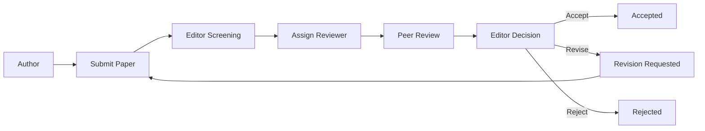

# Research Paper Submission & Review System

A role-based academic workflow prototype for managing research-paper submission, peer review, editorial assignment, and final decisions.

The repository provides front-end interfaces and a relational database schema for Authors, Reviewers, and Editors. It is suitable as a mini-project foundation and can be connected to a backend such as Node.js, PHP, Java, or Python.

## Core Roles

| Role | Main Responsibilities |
| --- | --- |
| Author | Register, submit papers, and track review status |
| Reviewer | View assigned papers, score submissions, and submit review feedback |
| Editor | Manage submissions, assign reviewers, and make final decisions |

## Features

- author dashboard and paper submission flow;
- reviewer dashboard and structured review form;
- editor dashboard and reviewer-assignment workflow;
- role-specific navigation and interfaces;
- normalized SQL schema;
- clean academic light theme;
- responsive HTML/CSS/JavaScript interface;
- clear workflow from submission to acceptance/revision/rejection.

## Project Structure

```text
login.html
signup.html
author-dashboard.html
submit-paper.html
reviewer-dashboard.html
submit-review.html
editor-dashboard.html
assign-reviewer.html
css/
└── style.css
js/
└── main.js
schema.sql
```

## Workflow



## Getting Started

### 1. Clone

```bash
git clone https://github.com/KVL3159H/RESEARCH-PAPER-SUBMISSION---REVIEW-SYSTEM.git
cd RESEARCH-PAPER-SUBMISSION---REVIEW-SYSTEM
```

### 2. Preview the Interface

Open `login.html` in a modern browser.

For a better local development experience, serve the folder with a lightweight development server instead of opening files directly.

### 3. Database

Import `schema.sql` into your selected relational database and adapt SQL syntax when necessary for MySQL/PostgreSQL differences.

## Backend Integration

The current repository is primarily an interface/database prototype. A production implementation should add a trusted backend responsible for:

- authentication and authorization;
- password hashing;
- paper-file storage;
- reviewer assignment;
- conflict-of-interest checks;
- review visibility rules;
- editorial decisions;
- audit logs;
- email/notification delivery;
- database validation and transactions.

## Security & Privacy

Research submissions may contain confidential or unpublished work. Before real institutional use:

- enforce server-side role checks;
- keep uploaded papers private;
- use encrypted transport;
- validate all uploads;
- restrict file types and sizes;
- protect reviewer identities according to the review model;
- log administrative actions;
- follow institutional data-retention requirements.

## Suggested Roadmap

- add a backend REST API;
- implement real login and session management;
- add secure PDF upload/storage;
- implement reviewer invitation and assignment states;
- add blind/double-blind review options;
- add email notifications;
- add automated tests;
- add deployment documentation.

## Contributing

Focused improvements are welcome, especially accessibility fixes, validation, backend integration, tests, and documentation.

---

Developed as an academic mini-project demonstrating the core lifecycle of research-paper submission and peer review.
