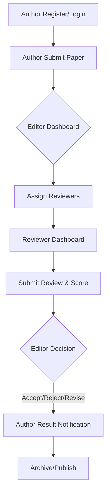

# Research Paper Submission & Review System

A professional, academic-focused management system for research papers. This system streamlines the peer-review process from submission to final decision, providing distinct interfaces for Authors, Reviewers, and Editors.

## 🚀 Features
- **Author Dashboard**: Submit research papers, track status, and manage active submissions.
- **Reviewer Portal**: Access assigned papers, provide scores, and submit detailed reviews.
- **Editor-in-Chief Panel**: Manage all submissions, assign reviewers, and make final editorial decisions.
- **Modern UI**: Clean, light-themed professional design focused on readability and academic standards.
- **Dynamic Forms**: Role-based signup and interactive file upload feedback.
- **Robust Database**: Fully normalized SQL schema ensuring data integrity.

## 📁 Project Structure
- `login.html` / `signup.html`: Authentication entry points.
- `author-dashboard.html` / `submit-paper.html`: Author-specific pages.
- `editor-dashboard.html` / `assign-reviewer.html`: Editor-specific pages.
- `reviewer-dashboard.html` / `submit-review.html`: Reviewer-specific pages.
- `css/style.css`: Core professional light theme stylesheet.
- `js/main.js`: Shared JS for UI interactions.
- `schema.sql`: Database initialization script with sample data.

## 🛠️ Getting Started
1. **Database Setup**: Import `schema.sql` into your MySQL/PostgreSQL database.
2. **UI Preview**: Open `login.html` in any modern web browser to explore the interfaces.
3. **Integration**: Connect these UI templates to a backend (PHP, Node.js, etc.) using the provided database schema.

## 📊 System Flowchart

---
*Developed for Mini Project: Research Paper Submission & Review System*
